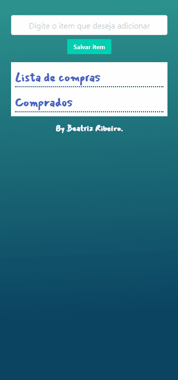

# List Of Items

O **List Of Items** é uma lista de compras, onde é possível inserir, editar e deletar itens. 

Os dados ficam armazenados no Local Storage do navegador.

## Linguagem Utilizada

## Demonstração do Projeto

List Of Items

## Deploy

[Clique aqui]([https://github.com/Biiars00](https://biiars00.github.io/list-of-items/))

### Desenvolvido por:

💕 [Beatriz Ribeiro | Biiars00](https://github.com/Biiars00)
